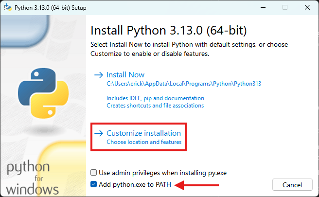
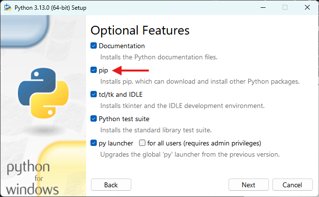
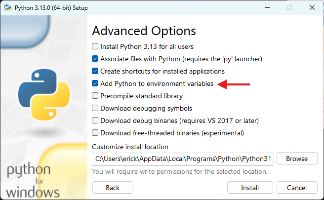

# NExT 2025.1

## **Lógica de Programação** com Python


## Aula 02 - Ambiente de Desenvolvimento Python

Python é uma das linguagens de programação mais populares atualmente, e configurar um **ambiente de desenvolvimento adequado local** é essencial para começar a programar com eficiência. Este material fornece um passo a passo para instalar Python e configurar o Visual Studio Code (VSCode) como seu ambiente de desenvolvimento.

------------------

## 1. Instalação do Python

### 1.1 Instalando Python no Windows

1. Baixar o Instalador:
    * Acesse o site oficial do Python [aqui](https://www.python.org/);
    * Clique em `Downloads` > `Download for Windows` > `[versão do Python]`.

2. Executar o Instalador:
    * Abra o arquivo baixado;
    * Na tela inicial, selecione a opção `Add python.exe to PATH`;
    * Clique em `Customize installation` para ajustar as opções.

    

3. Configurações de Instalação:
    * Certifique-se de marcar as opções:
        * `pip`;
        * `Python test suite`;
        * 
        * `Add Python to environment variables`;
        * 

    * Clique em `Install`.

4. Verificar a Instalação:
    * Abra o Prompt de Comando e execute:

        ```sh
        python --version
        ```

    * Deve exibir a versão instalada.

### 1.2 Instalando Python no Linux

1. Usar o Gerenciador de Pacotes:

    * Para distribuições baseadas em Debian (como Ubuntu):

        ```sh
        sudo apt update
        sudo apt install python3 python3-pip
        ```

    * Para distribuições baseadas em Red Hat (como Fedora):

        ```sh
        sudo dnf install python3 python3-pip
        ```

2. Verificar a Instalação:

    * Execute no terminal:

        ```sh
        python3 --version
        ```

3. Configurar Python como Padrão (opcional):

    * Atualize o link simbólico:

        ```sh
        sudo update-alternatives --install /usr/bin/python python /usr/bin/python3 1
        ```

### 1.3 Instalando Python no macOS

1. Instalar com Homebrew:

    * Abra o Terminal e execute:

        ```sh
        brew install python3
        ```

2. Verificar a Instalação:

    * Confirme a versão:

        ```sh
        python3 --version
        ```

## 2. Instalação do VSCode

### 2.1 Baixando e Instalando o VSCode

1. Download:

    * Acesse o site oficial do VS Code [aqui](https://code.visualstudio.com/);
    * Baixe o instalador para o seu sistema operacional.

2. Instalação:

    * Windows: Siga o assistente de instalação.
    * macOS: Arraste o ícone para a pasta Applications.
    * Linux: Extraia o arquivo e crie um atalho no menu.

### 2.2 Configurações Básicas

1. Abrir o VSCode:

    * Execute o VSCode e configure o idioma, se necessário.

2. Habilitar o Python no PATH (Windows):

    * No terminal integrado do VSCode, verifique o Python executando:

        ```sh
        python --version
        ```

    * Se não reconhecer, adicione o Python ao PATH.

## 3. Extensões Básicas para Python no VSCode

1. Python Extension:

    * Vá em Extensions (ícone com quadrados no menu lateral esquerdo).
    * 
    * Pesquise por "Python" e instale a extensão oficial da Microsoft.

2. IntelliCode:

    * Fornece sugestões inteligentes com base no seu código.

3. Pylance:

    * Um servidor de linguagem Python para autocompletar e verificar tipos.

4. Jupyter (_opcional_):

    * Necessário para trabalhar com notebooks interativos (como os do Colab).

## 4. Configurações no VSCode

> ⚠️ Os passos a seguir podem não ser necessários, caso a instalação do Python tenha ocorrido com sucesso.

### 4.1 Selecionar o Interpretador Python

1. Pressione Ctrl+Shift+P (ou Cmd+Shift+P no macOS).
2. Digite `Python: Select Interpreter`.
3. Escolha a versão do Python instalada.

## 5. Testando o Ambiente de Desenvolvimento

1. Criar um Arquivo Python:

    * Abra o VSCode e crie um arquivo chamado hello.py.
    * Escreva o seguinte código:

        ```python
        print("Hello, World!")
        ```

2. Executar o Código:

    * Abra o terminal integrado (Ctrl+\` ou Cmd+\` no macOS).
    * Execute o arquivo:

        ```sh
        python hello.py
        ```

## Seguir para Aula 02

[👉 Clique aqui!](Aula02.md)
